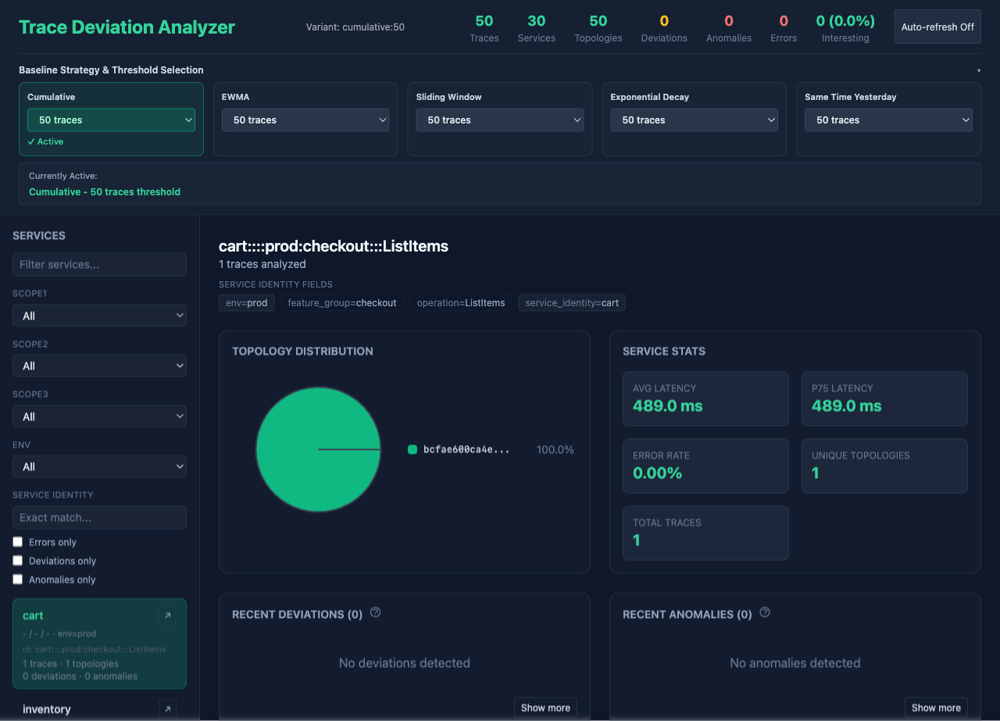
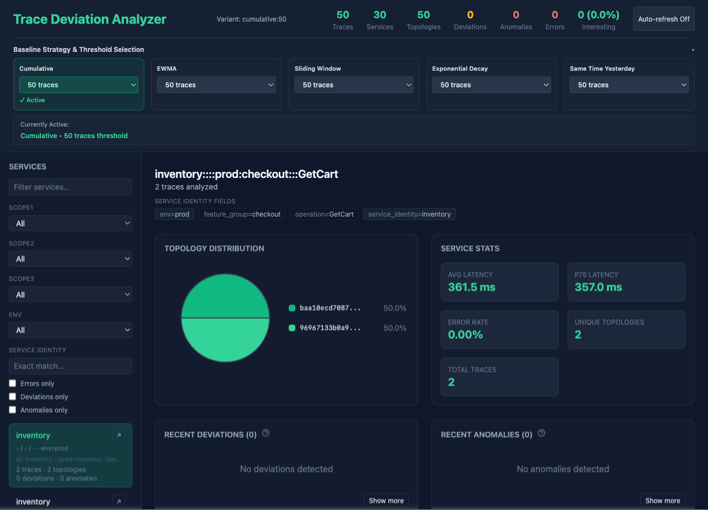
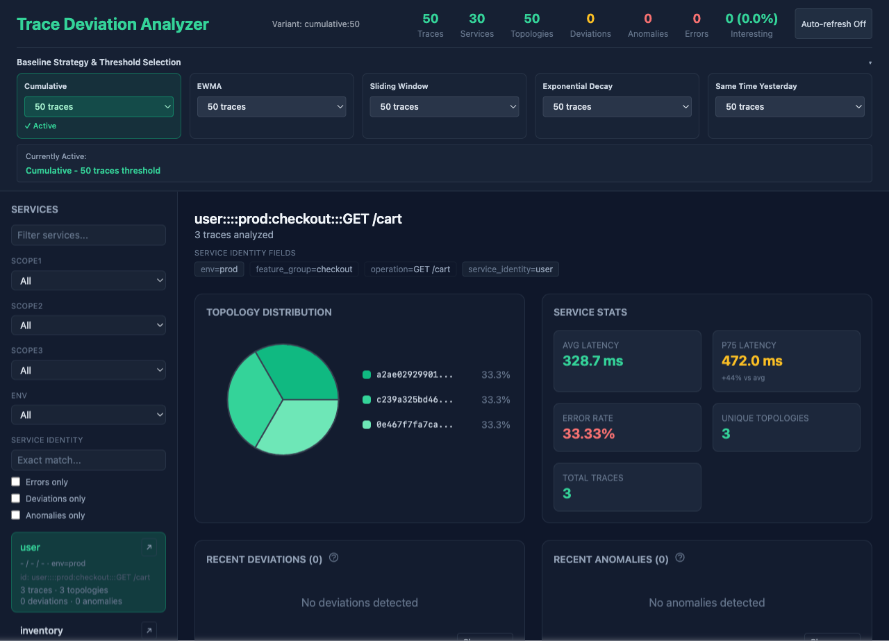
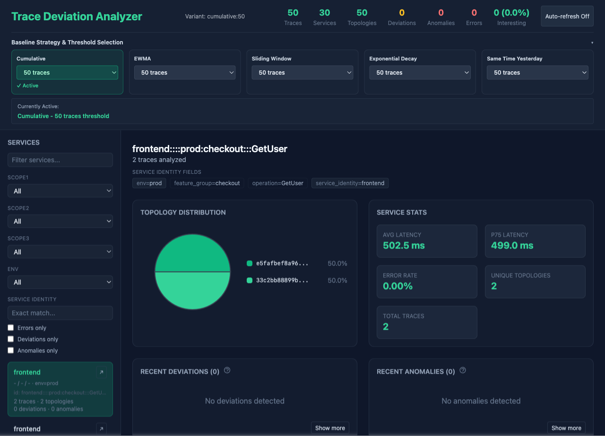

# Trace Analyzer

**Per-path analysis of distributed traces** — group requests by the shape of their call graph, then track each execution path separately with drift detection and anomaly scoring.

A checkout endpoint might have a cache-hit path, a cache-miss path, and a fallback that calls two extra services. Service-level metrics tell you the p99 moved. This tells you *which path* is responsible.

<p align="center">
  
</p>

## What it does

- **Fingerprints traces** by their call-graph topology (Weisfeiler-Lehman graph hashing). 712 HotROD traces collapse to ~5 fingerprints.
- **Baselines per path, per service** — not per service average. Each fingerprint gets its own latency/duration distribution.
- **Drift detection** — flags new paths, rare paths, sudden frequency shifts, and statistical anomalies. Four baseline strategies (cumulative, EWMA, sliding window, exponential decay) each with 4 min-sample thresholds = 20 independent combinations.
- **Anomaly scoring** — weighted z-score with configurable threshold, runs against every learned combination.
- **Cold tier** — hourly rollups + interesting traces shipped to S3-compatible storage (SeaweedFS in compose).

## Screenshots

| Home (service list + topology) | Topology detail | Deviations | Anomalies |
|---|---|---|---|
|  |  |  |  |

## Quick start

```bash
# Prerequisites: Docker + Docker Compose
git clone https://github.com/sarkaramrit1993/trace-analyzer-public.git
cd trace-analyzer-public
docker compose up --build
```

Then:
- **Web UI**: http://localhost:14000
- **API health**: http://localhost:18080/health
- **Ingest spans**: `POST http://localhost:18080/api/spans/batch` (see [README examples](#ingest-example))

## Ingest example

```bash
curl -X POST http://localhost:18080/api/spans/batch \
  -H 'Content-Type: application/json' \
  -d '[{"TraceID":"t1","SpanID":"a","ParentID":"","OperationName":"GET /","StartTime":1735689600000000,"Duration":5000,"ServiceName":"frontend","Tags":{}},
       {"TraceID":"t1","SpanID":"b","ParentID":"a","OperationName":"GetCart","StartTime":1735689600001000,"Duration":2000,"ServiceName":"cart","Tags":{}}]'
```

Traces assemble after 180s (configurable via `TRACE_ASSEMBLY_TIMEOUT_SECS`). See `/api/services`, `/api/variants/combinations`, `/api/deviations`.

## Why this design

| Problem | Typical approach | Here |
|---------|------------------|------|
| "Service X is slow" | Aggregate p99 | Which *execution path* through X changed? |
| "Did behavior change?" | Dashboard eyeballing | Per-path statistical drift detection |
| "What caused the regression?" | Trace spelunking | Deviations & anomalies tagged to a fingerprint |

## Architecture

```
SSE ingest → Assembler (per-trace timer) → Fingerprinter (WL hash)
                                                    ↓
                                VariantManager.UpdateAll (20 combinations)
                                                    ↓
                                 DeviationDetector + AnomalyScorer
                                                    ↓
                                     SQLite (hot) → SeaweedFS (cold)
```

- Single Go process: ingestion, analysis, storage, HTTP API
- React + Vite frontend (TypeScript, React Flow, TanStack Query, Zustand)
- No external DB, no message bus, no Kubernetes required

## Baseline strategies

Each trace updates **all 20 combinations** by default (configurable via `LEARN_COMBINATIONS`). The active combination drives the UI and alerts; the other 19 learn silently for comparison.

| Variant | Behavior | Default min-samples |
|---------|----------|---------------------|
| `cumulative` | Stable, all-history reservoir | 50 |
| `ewma` | Fast adaptation to recent shifts | 500 |
| `sliding_window` | Fixed recent window | 100 |
| `exponential_decay` | Gradual forgetting | 5000 |
| `same_time_yesterday` | Daily seasonality | 500 |

See [docs/DESIGN.md](docs/DESIGN.md) for the baseline strategies and key decisions.

## Known limits (honest)

- **Detection accuracy** has no ground-truth evaluation — the scores are heuristic.
- **Fingerprint granularity** is coarse on simple apps (HotROD gives 5). Real services with input-dependent fan-out produce many more.
- **Same-time-yesterday** only compares against hourly history, not full seasonality.
- **Memory grows** with unique paths per service — 20 combinations × path count.
- **Only active combination** survives restart unless `ACTIVE_COMBINATION` is set.

See [docs/DESIGN.md](docs/DESIGN.md) for the known limits.

## Tech stack

- **Go 1.21+** — analyzer, SQLite, SSE client, graph fingerprinting
- **React 18 + TypeScript** — Vite, TanStack Query, React Flow, Zustand, Recharts
- **SeaweedFS** — S3-compatible cold tier (optional `docker compose --profile cold up`)
- **CI** — GitHub Actions: Go build/test/race/vet, web typecheck/test/build, Python pipeline tests, Docker build, forbidden-string hygiene

## License

MIT — see [LICENSE](LICENSE).

---

*Built to be defensible in a code review. If you find something that doesn't match the claims, open an issue.*